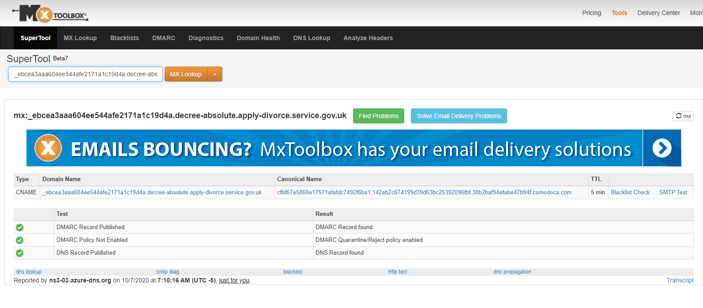
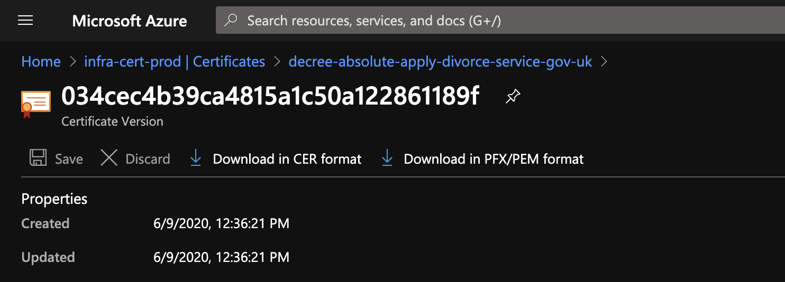
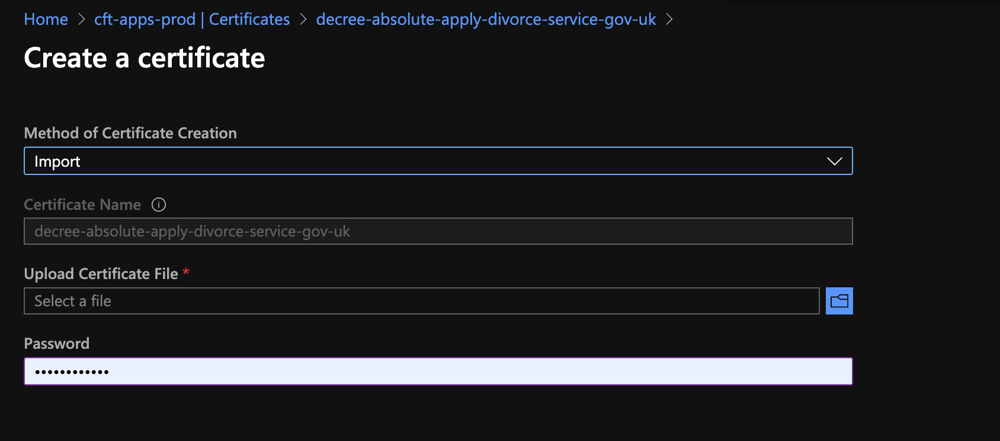

# Manually Generated Certificates

This article describes the process for issuing or renewing an SSL certificate that is not suitable for our automated certificates in the other guides of this chapter.

## Prerequisites

- A local version of the [rdo-ssl-creation repo](https://github.com/hmcts/rdo-ssl-creation/tree/openssl-mac-branch)
- A local version of the [azure-public-dns repo](https://github.com/hmcts/azure-public-dns)
A certificate in need of renewal (either a notification from Ops or a Jira ticket that has followed this guide: Requesting a SSL Certificate from Platform Operations)

We have a certificate tracker which is populated a month in advance by the Operations team with certs that are expiring soon, view it on [sharepoint](https://cjscommonplatform-my.sharepoint.com/:x:/r/personal/zoe_cope_hmcts_net/_layouts/15/Doc.aspx?sourcedoc=%7B6C8A9500-4D9D-45EA-8CC7-D75F3DDFF133%7D&file=Cert%20Tracker.xlsx&action=default&mobileredirect=true), you may need to request access.


## Step-by-step guide:
There are 3 key stages to the renewal process:

- [Generate the CSR and request form](#Step-1:-Generate-the-CSR-and-request-form)
- [Point the DNS](#Step-2:-Point-the-DNS)
- [Upload the certificate to Azure](#Step-3:-Upload-the-certificate-to-Azure)

#### Note:
If someone has requested for a new SSL certificate to be ordered, you should check if Azure has delegation of the domain (assuming it is being hosted in Azure). 
You can do this by going on https://mxtoolbox.com/ and running a DNS Check.
If there are no results, you should contact the requester and get them to create the domain and DNS zone.
DNS zones are created in https://github.com/hmcts/azure-public-dns.

From there, they need to have the NS records at hand to pass over to whoever does the delegation.
For hmcts.net domains, contact the Operations team for delegation.
For service.gov.uk domains, you need to contact Government Digital Service (GDS) - you can speak to Cairbre Smith to assist with that.

### Step 1: Generate the CSR and request form


This section is described in detail [on this page](csr.md).

Once the CSR and form has been generated, they are sent via email to Ops Config Management (opsconfman@hmcts.net).

### Step 2: Point the DNS


Ops then return the validation instructions for pointing the DNS, for example:

> "Please add the following DNS record: _EBCEA3AAA604EE544AFE2171A1C19D4A.decree-absolute.apply-divorce.service.gov.uk. 10800 IN CNAME 
CFBF67E5860E17571AFAFDC7492F6BA1.142AB2C674199D39D63BC25392096FBF.38b2baf94efabe47b94f.comodoca.com."

> Pointing the DNS is done using this repo:
https://github.com/hmcts/azure-public-dns


With the example above, the address would belong in the "apply-divorce-service-gov-uk.yml" file.

These are some of the domains, but make sure you search the repo for the domain to find the one you are after:


_*Addresses which do not fall into any of these domains may be managed using a different service (eg legacy AWS dns zone)._

The format for pointing the DNS, using the example described in the validation instructions above, is as follows:

```yaml
 - name: "_ebcea3aaa604ee544afe2171a1c19d4a.decree-absolute"
   ttl: 300
   record: "CFBF67E5860E17571AFAFDC7492F6BA1.142AB2C674199D39D63BC25392096FBF.38b2baf94efabe47b94f.comodoca.com."
```

This is the DNS pointings when seen in the pull request:

Broken down, the changes made to the validation instructions to achieve the correct format are:


**1. Add the name:**

- Remove `.apply-divorce.service.gov.uk`, since this is added automatically.
E.g:
`_EBCEA3AAA604EE544AFE2171A1C19D4A.decree-absolute.apply-divorce.service.gov.uk`

_becomes_

\- name: `_ebcea3aaa604ee544afe2171a1c19d4a.decree-absolute`

**2. Add a time to live**
- any number would work, we use 300 seconds (5 minutes) for practicality, e.g. `ttl: 300`.

**3. Add the record**

Remember to keep the full-stop at the end of the CNAME.
`CFBF67E5860E17571AFAFDC7492F6BA1.142AB2C674199D39D63BC25392096FBF.38b2baf94efabe47b94f.comodoca.com.`
becomes record: `CFBF67E5860E17571AFAFDC7492F6BA1.142AB2C674199D39D63BC25392096FBF.38b2baf94efabe47b94f.comodoca.com.`

Once you have raised the PR and it has been approved and merged, you can check on the build on  [Azure DevOps](https://dev.azure.com/hmcts/PlatformOperations/_build?definitionId=278).

Prior to notifying Operations, check in [MXToolBox](https://mxtoolbox.com/) that the DNS has been propagated successfully, this will prevent possible delays. Use the whole name of the record like so:

Once the DNS has been pointed, reply to the operations team saying you've added the DNS records. They will return the generated cert as an email attachment.

### Step 3: Upload the certificate to Azure


1. Download the email attachment


2. _(Optional but recommended)_ Create a new folder

This is to keep your files organised and avoid confusion. Name it as you see fit, for example as below:


Copy and paste the relevant contents from the 'makepfx' folder in [RDO-SSL-Creation](https://github.com/hmcts/rdo-ssl-creation/tree/openssl-mac-branch), into the newly created folder. The below files now exist in 'decree-absolute':


In the terminal, change directory to the new folder in and place the downloaded cert from step 1 inside it.

3. Convert the .txt file to a .p7b:

`openssl crl2pkcs7 -nocrl -certfile decree-absolute.apply-divorce.service.gov.uk.crt.txt -certfile cert-chain -out decree-absolute.apply-divorce.service.gov.uk.p7b`

4. Go to Azure Key Vault → decree-absolute-apply-divorce-service-gov-uk → certificate operation → 'merge signed request' and upload the p7b file.


Once the merge is complete, you should see this:


:information_source:  At this point, the certificate is now renewed / procured. 

The next steps are required only if the certificate is being placed in another vault in addition to infra-cert-prod. You can find out if required by either speaking to the dev who requested the cert or searching key vaults in Azure.

If you are renewing a certificate, it is common to check vaults such as, but not limited to, `cft-apps-prod` or `<projectacronym>-prod` for production certificates, `cftapps-dev` for development certificates, etc, and observing whether an old version of the renewed cert is there.

5. Click into the current certificate version and download the pfx file by selecting 'Download in PFX/PEM format'


_**Optional:**_ Display private key.

If in case you are procuring a certificate for a developer in another project for example, they would require the private key as they may not have access to the key vault. To display the certificate's private key, run below command. At this point, there is no password, so just press enter when prompted for one.

> cat infra-cert-prod-decree-absolute-apply-divorce-service-gov-uk-20200609.pfx | openssl pkcs12 -nodes

6. Add a password to the cert:
Move the pfx file into the 'makepfx' folder.
Run from the makepfx folder:

> ./pfxpassword.sh infra-cert-prod-decree-absolute-apply-divorce-service-gov-uk-20200609.pfx

7. Add the cert to the relevant key vault

In this case, it's **cft-apps-prod**. 

Go to the relevant cert (decree-absolute-apply-divorce-service-gov-uk) → new version → import → upload the cert.pfx file and type in the password.

_*The password can be found in the 'pfxpassword.sh' file in the 'makepfx' folder._


You should see this:


### * Shared Services and PET Certificates only *
For some certs the process is slightly different, example certs include

- juror-bureau.justice.gov.uk
- reply-jury-summons.service.gov.uk

a) Download pfx of the renewed cert from the vault

b) Convert to base 64
> openssl base64 -in ~/Downloads/traefik-jb.pfx -out ~/Downloads/traefik-jdbase64.kl

c) Reverse engineer and find new vault - e.g. shared service - `ss-vault-prod`

d) Restart traefik pods so its picks up new certs

#### Common Errors and Solutions 

| Error | Solution | 
|-----------------|:-------------|
| employment.service.gov.uk mxtool DNS check cannot find record |   | 
