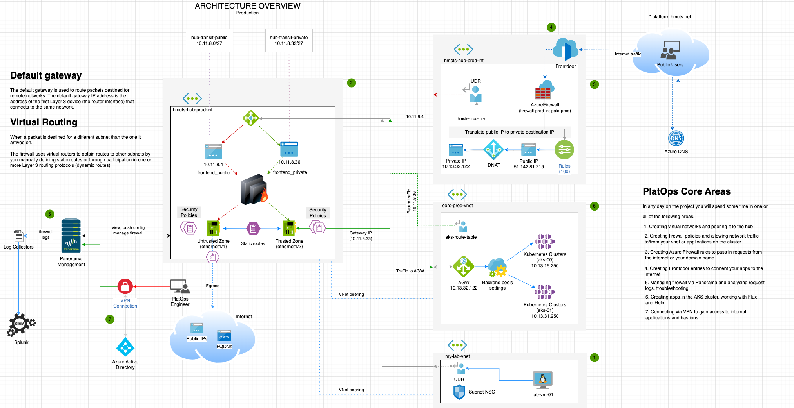

# Platform Operations Golden Path

## Welcome to the Group
### More about PlatOps

## About the Golden Path
The PlatOps Golden path seeks to introduce our engineers to some key areas and technologies stack
that they most certainly will encounter on the project.

It will also provide links to additional repositories and walk you through some hands-on
exercise to get you familiar with them and the Azure portal.

#### Repositories to checkout
- [rdo-terraform-hub](https://github.com/hmcts/rdo-terraform-hub-dmz)
- [hub-panorama-terraform](https://github.com/hmcts/hub-panorama-terraform)
- [azure-platform-terraform](https://github.com/hmcts/azure-platform-terraform)
- [azure-public-dns](https://github.com/hmcts/azure-public-dns)
- [GoldenPath-platops](https://github.com/hmcts/goldenpath-platops)

### The Architecture

### What you will learn
At the end of this exercise you would have been introduced to the following technologies
- Kubernetes
- Flux/Helm
- Palo Alto Firewalls
- Azure Firewall
- Hub and Spoke Network Architecture
- Panorama Management
- GitHub and source control
- Azure DevOps Pipeline
- Azure FrontDoor

You will have a fill of the HMCTS landscape

#### GoldenPath Sections
- [Azure Kubernetes Services - AKS Clusters](path-1-clusters.md)
- [Firewalls - Azure & Palo Alto](path-2-firewalls.md)
- [Azure FrontDoor](path-3-frontdoor.md)
- [Logs](path-4-logs.md)
- [Clean Up](path-4-logs.md)

#### GoldenPath HandsOs
To follow the hands on check out the [goldenpath-paltops](https://github.com/hmcts/goldenpath-platops) repo and follow the instructions

### Feedback
We would appreciate your feedback at the end of this exercise. This would help us improve
on this for other engineers. Please leave your on the _#platops-goldenpath_ channel.