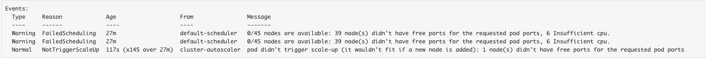

# AKS Known Issues

Known issues encountered during AKS cluster update or rebuild

## DaemonSet Failed Scheduling

For a DaemonSet application (e.g. CSI driver, Oneagent or Kured), when applying an update or patch which requires a restart, a pod on a specific node may fail scheduling and blocks the rolling update from proceeding with restarting other pods.  

An error similar to the below may be seen in the cluster events log:  

- This happens when there is a capacity issue on specific cluster nodes
- DaemonSet rolling update is blocked with the pod stuck in `Pending` state
- Deleting the pod does not fix issue as pod restarts and goes into same `Pending` state
  
- Run `kubectl get pod <podname> -o yaml | grep nodeName` to identify the node where pod scheduling has failed
- Run `kubectl get pods -A | grep <node name>` to list all pods running on node
- Identify and delete one or more non-DaemonSet pods to restart on a different node and free up a capacity on the current node  
- If deleted pods are stuck in `Terminating` state, use `kubectl delete pod <podname> --grace-period 0 --force` to forcefully delete pod
- Confirm DaemonSet pod now starts successfully

## Dynatrace oneagent pods not deployed or failing to start

**NOTE:** The issue described here needs to be validated if still applies when the updated [Dynatrace Operator](https://tools.hmcts.net/jira/browse/DTSPO-6187) is rolled out.

For a rebuild or newly deployed cluster, Dynatrace oneagent pods are either not deployed by Flux or where deployed, fails with a `CrashLoopBackOff` status.

Dynatrace Helm Chart [requires](https://github.com/Dynatrace/helm-charts/blob/3c6ac8e9d9d62c1925e79f3fbd93e6be9af1bbea/dynatrace-oneagent-operator/chart/default/app-readme.md#additional-instructions) CRDs to be applied before installing the chart. The CRDs currently need to be manually applied as they are not part of the existing Flux config.

Run the below command on the cluster. An empty result confirms CRDs are not installed. 

`kubectl get crds | grep oneagent`

To fix, run the below command to apply CRDs to the cluster:

`kubectl apply -f https://github.com/Dynatrace/dynatrace-oneagent-operator/releases/latest/download/dynatrace.com_oneagents.yaml`  

`kubectl apply -f https://github.com/Dynatrace/dynatrace-oneagent-operator/releases/latest/download/dynatrace.com_oneagentapms.yaml `

**Note**: A Flux config to apply the CRDs was previously tested ([PR14321](https://github.com/hmcts/cnp-flux-config/pull/14312)) but rolled back due to issues in prod.  Change will need to be revisited with the Producation AKS cluster now upgraded to v1.21.7