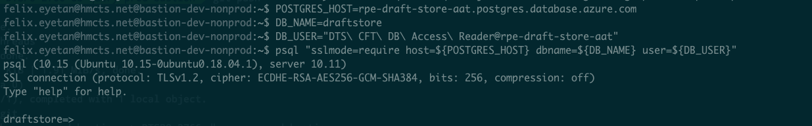
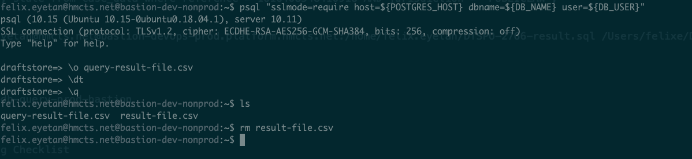
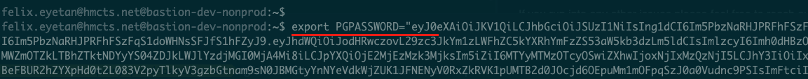

# DB Queries from Prod Bastion

Steps to take when there is the need to access production database.
Other teams sometimes need certain pieces of information from the production Db and would raise
a ticket, providing their sql query and requesting PlatOps run these against
production Db as they don't have access to this.

ℹ️ *Note:* there's a [self service](https://tools.hmcts.net/confluence/display/DTSPO/%5BSelf-Service%5D+Database) process that should be used by the team if they have an SC person on their team instead.

To fulfill one of these request, you can follow the steps below.

## Prerequisites 💥
* **Important:** Verify you are all setup as outlined in [cnp-module-postgres](https://github.com/hmcts/cnp-module-postgres#production)
* Grant yourself access to production Bastion as outlined in [cnp-module-postgres](https://github.com/hmcts/cnp-module-postgres#production), in the `Steps to access` section of the document <br>
  **Note:** If not on call then just one day is sufficient

## Suggested Steps

* Confirm the database connection host. This should be in the ticket, but you can also confirm by searching it in the portal on [Azure](https://portal.azure.com/#home) <br>
* Sanity check the query provided in the ticket, not that you are expected to know any sql 🤥 <br>
  Sometimes typos or misplaced variables are easy to spot
* Jump onto the production bastion, steps on how to do this are in the [cnp-module-postgres](https://github.com/hmcts/cnp-module-postgres#production)  documentation <br>
  _Example:_<br>
  

## Executing Queries
Once on the bastion server you can execute queries against the db in any number of ways, below are some suggestions

### Small queries

* Connect to  Postgres by following commands outlined in [cnp-module-postgres](https://github.com/hmcts/cnp-module-postgres#production) <br>
* Once in, you can execute provided query
  ```cmd
   psql> paste your query here;
  ```
  **Note:** The prompt would most likely be the `DB_NAME` you provided in steps you followed when connecting to the DB
* Copy the output result and send it to the authorised recipient, this is usually mentioned in the ticket. If not mentioned, then confirm with team members before sending data off  
* For small queries with large results, you could do the following to output to file
  ```cmd
  \o <filename>.csv
    <your query here>
  \q
   ```
  This should create a file called `<filename>.csv` with the output in it. <br>
  **Note:** the extension could be whatever you choose, here am using csv <br>
  _Example:_<br>
  

### Larger, lengthier queries

* Connect to Postgres as described in above step
* Create a new file, for example
  ```cmd
  vi <ticket-number>-<any-extras-labeling>.sql
  ```
  You could use `nano` as well. Just replace `vi` with `nano`
* Copy/paste query and save it
  ```cmd 
  :wq!
  ```
  If using `nano` then use its equivalent
* Once file is saved you could run the command passing the file as input to Postgres.
  ```cmd 
  psql "sslmode=require host=${POSTGRES_HOST} dbname=${DB_NAME} user=${DB_USER}" -o DTSPO-2766-result.csv < DTSPO-2766-get-case-data.sql
  ```
* If no errors, you can `cat` the output file for a quick eye-balling 👀
  ```cmd 
  cat <output-file>.csv
  ```

### Bringing query file home
You can use any `sftp` tool of your choice to connect to bastion or follow below steps

* Log out of your ssh terminal by exiting
* Copy the file from the bastion server right from your terminal
  ```cmd 
  scp user.name@hmcts.net@bastion-devops-prod.platform.hmcts.net:/home/user.name/DTSPO-2766-result.csv /Users/<location-of-choice>
  ```
  `/Users/<location-of-choice>` being a path on your file system, here is an example using a MAC
* You can now send the file(s) to authorised recipient(s) or share as instructed in the ticket.<br> 
  If unclear, confirm with team members.
  
If you run into any other issues please feel free to reach out to team members.

## Notes
In the in [cnp-module-postgres](https://github.com/hmcts/cnp-module-postgres#production) documentation
```cmd
export PGPASSWORD=<result-from-earlier>
```
Assign to the variable `PGPASSWORD` the token returned from the `az account get-access-token ...` command you ran earlier <br>
_Example:_<br>


## Some external reference

You can have a quick peak for some `psql` info that may be useful
* [Outputting Query Results to Files with \o](https://dataschool.com/learn-sql/outputting-query-results-to-files-with-o/)
* [How to run an SQL file in Postgres](https://kb.objectrocket.com/postgresql/how-to-run-an-sql-file-in-postgres-846)
  - Run a SQL file in Postgres using the ‘psql’ command 
  - Connect to PostgreSQL and then run a SQL file using ‘psql’
