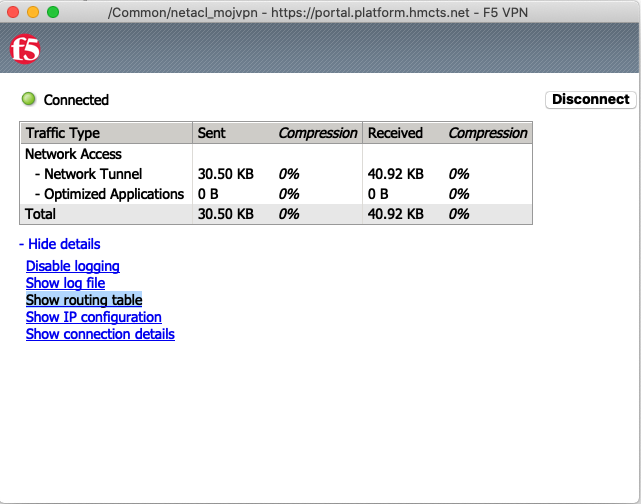
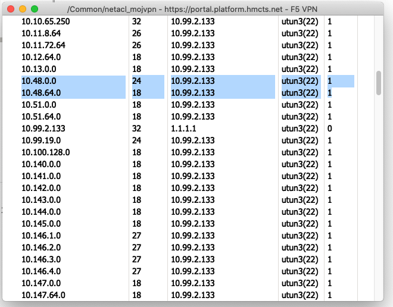

# F5 VPN routing config

This document details the steps to configure routing to make internal apps available over the vpn.

Login to https://vpn.platform.hmcts.net/.
If you are accessing the F5 portal for the first time or lose your login details, a person with existing access can provide you with new credentials.

List of current admins

arahman
benn
chriso
dbromwich
hannahs
jordanb
lbitonti
louiseh
matts
mohanay
pkumar
praveena
taherk
thomast
timja
tkimber
zoec

 .

For making the changes to the ACL: click 'Access Control Lists' tab under the 'Access' tab and select `acl_vpn_reform`, page linked here:
[Access Control List](https://vpn.platform.hmcts.net/tmui/Control/jspmap/tmui/accessctrl/acls/list.jsp)

You will see a list of ACLs for all the entries. Find the one which you need to edit. The CIDR range will be in the column labeled as Dst IP/Mask.
Note: If using Firefox then the search function probably won't find the IP address you type in.
[ACL Properties](https://vpn.platform.hmcts.net/tmui/Control/jspmap/tmui/accessctrl/acls/properties.jsp?name=/Common/acl_vpn_reform)

You will find 2 entries; HTTP and HTTPS. Change it to add new CIDR range, such as below:

Navigate to Connectivity profiles to make a corresponding change to the routing.
[Connectivity Profiles](https://vpn.platform.hmcts.net/tmui/tmui/util/ajax/app.jsp?appId=apps.AccessPolicy.perclientpolicy)

Add the new CIDR range under IPV4 and IPV6 . After verification, click on the `Apply Access policy` on the top left corner of the portal to propagate the routing changes.
[MoJ VPN ACL](https://vpn.platform.hmcts.net/tmui/Control/jspmap/tmui/remconnectivity/nwaccessresources/l2_settings.jsp?name=/Common/netacl_mojvpn&type=1)

Logout of your current F5 VPN session and log back in to validate if the route propagation has taken place for the new AKS network address space as shown below:

