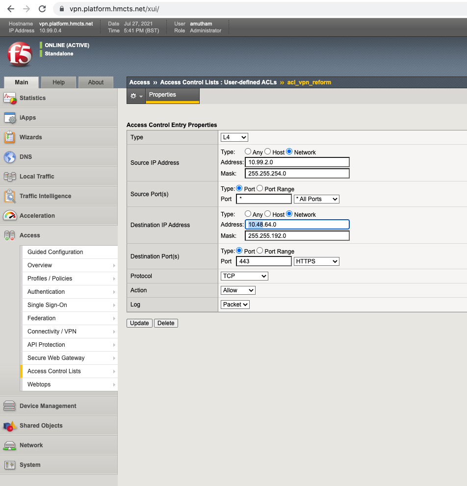

# F5 VPN routing config

This document details the steps to configure routing to make internal apps available over the vpn.

Login to https://vpn.platform.hmcts.net/. 
If you are accessing the F5 portal for the first time or forget your login details, a person with existing access can provide you with new credentials.

For making the changes to the ACL: click 'Access Control Lists' tab under the 'Access' tab as shown in the screenshot below and select `acl_vpn_reform`

You will see a list of ACLs for all the entries. Based on the CIDR range of the old AKS vnet address space, find the one which you need to edit. The CIDR range will be in the column labeled as Dst IP/Mask.
Note: If using Firefox then the search function probably won't find the IP address you type in.

You will find 2 entries; HTTP and HTTPS. Change it to add new CIDR range (Network address space of AKS to be swapped to) as below:

Navigate to Connectivity profiles to make a corresponding change to the routing.

Under the Network Access (VPN) select the Network Access List as shown below:

Click netacl_mojvpn and navigate to Network Settings to add the new CIDR range (Network address space of AKS to be swapped to) under IPV4 and IPV6 . After verification, click on the `Apply Access policy` on the top left corner of the portal to propagate the routing changes.

Logout of your current F5 VPN session and log back in to validate if the route propagation has taken place for the new AKS network address space as shown below:

