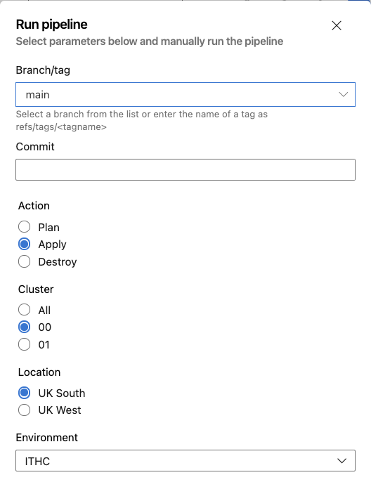
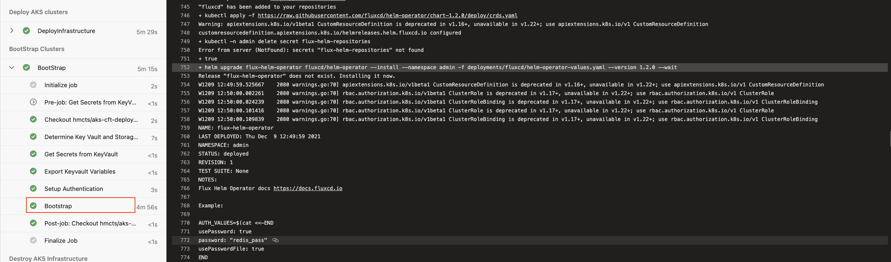

# Restarting Flux

Steps for troubleshooting Flux related issues are well documented in [The HMCTS Way - Flux Troubleshooting Steps ](https://hmcts.github.io/ways-of-working/troubleshooting/#flux-gitops)  
On rare occasions, it may be required to either restart or reinstall Flux to fix issues.

### Confirm Flux V1 to V2 Migration Status
Whilst applications are being migrated to Flux v2, both Flux v1 and v2 exist side-by-side depending on the migration status in [CFT](https://github.com/hmcts/cnp-flux-config#migration-status) and [SDS](https://github.com/hmcts/shared-services-flux#flux-v2-migration-status).  


### Confirming Flux is Operational
#### Flux v1
- Flux pods are running
- No sync errors in flux pods
- No duplicate config blocking flux sync

#### Flux v2
- Flux pods are running
- No sync errors in flux pods
- No duplicate config blocking flux sync

### Restart Flux v1

1. Connect to AKS cluster  
2. List flux pods
3. Delete flux pods
4. Confirm pods have restarted
5. Confirm flux is operational

# Reinstalling Flux

### Reinstall Flux v1/v2

1. Connect to AKS cluster
2. Uninstall Flux Helm Operator (Flux v1 only) by running the below
   ```
   helm --kube-context <kubeconfig context> --namespace admin uninstall flux-helm-operator
   ```
3. Run the relevant pipeline below to reinstall Flux  
   - CFT - [CFT AKS Deploy](https://dev.azure.com/hmcts/CNP/_build?definitionId=483)
   - SDS - [CFT SDS Deploy](https://dev.azure.com/hmcts/PlatformOperations/_build?definitionId=482&_a=summary)
  <details>

  <summary>Example Pipeline Run</summary>

    
  The above will reinstall Flux v1 and V2 on UK South ITHC Cluster-00  

  **Note**: Flux is installed at the bootstrap stage  

  
  </details>
   
4. **Note**: Only perform this step if Flux v1/v2 coexist on cluster. Delete flux-helm-operator ClusterRoleBinding as it will have an invalid config and reported in Flux logs   
      ```
   kubectl delete clusterrolebinding flux-helm-operator
   ```
   After deletion, it will automatically get restored by Flux v2 with the correct configuration  
   
5. Confirm flux is operational
