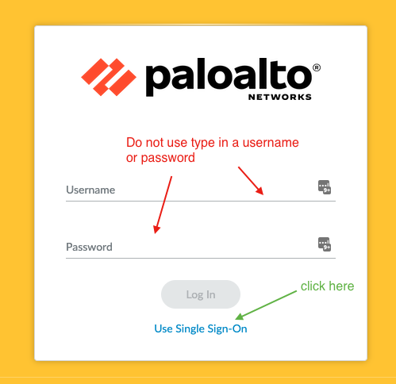
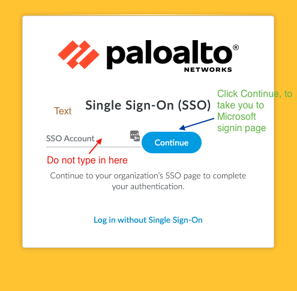

# Connecting to a Palo Alto firewall

## UK South 

You can connect to the Palo VMs via the HMCTS VPN by following the following steps: 

### Sandbox

1. Log on to the F5 VPN.

2. From the login page (virtual machines for env), click on the `Use Single Sign-On` link
  <details>
   <summary>View screenshot!</summary>

  

3. On the `Single Sign-On (SSO)` page, leave input box empty, click the `Continue` button
  <details>
   <summary>View screenshot!</summary>

  
  </details>
4. Provide your HMCTS login details and you will be redirected to Microsoft login page, if you've not already signed in.

5. After successful authentication you'll be redirected back.

<details>
<summary>Sandbox virtual machines</summary>

### Sandbox

- [hmcts-hub-sbox-int-palo-vm-0](https://portal.azure.com/#@HMCTS.NET/resource/subscriptions/ea3a8c1e-af9d-4108-bc86-a7e2d267f49c/resourceGroups/hmcts-hub-sbox-int/providers/Microsoft.Compute/virtualMachines/hmcts-hub-sbox-int-palo-vm-0/overview) - https://uksouth-palo-0.sandbox.platform.hmcts.net
- [hmcts-hub-sbox-int-palo-vm-1](https://portal.azure.com/#@HMCTS.NET/resource/subscriptions/ea3a8c1e-af9d-4108-bc86-a7e2d267f49c/resourceGroups/hmcts-hub-sbox-int/providers/Microsoft.Compute/virtualMachines/hmcts-hub-sbox-int-palo-vm-1/overview) - https://uksouth-palo-1.sandbox.platform.hmcts.net

</details>

### Non-prod 

1. Connect to the [HMCTS VPN](https://portal.platform.hmcts.net/).
2. Retrieve the url of the Palo VM you want to connect to via the 'Virtual machines' section below.  
3. Retrieve the admin password from the relevant key vault:

    ```
    # Non production
    az keyvault secret show --vault-name hmcts-infra-dmz-nonprodi --name firewall-password --query value -o tsv
    ```

4. Use the local account `localadmin`

<details>

<summary>Non-prod virtual machines</summary>

- [hmcts-hub-nonprodi-palo-vm-0](https://portal.azure.com/#@HMCTS.NET/resource/subscriptions/fb084706-583f-4c9a-bdab-949aac66ba5c/resourceGroups/hmcts-hub-nonprodi/providers/Microsoft.Compute/virtualMachines/hmcts-hub-nonprodi-palo-vm-0/overview) - https://uksouth-nonprod-palo-0.platform.hmcts.net
- [hmcts-hub-nonprodi-palo-vm-1](https://portal.azure.com/#@HMCTS.NET/resource/subscriptions/fb084706-583f-4c9a-bdab-949aac66ba5c/resourceGroups/hmcts-hub-nonprodi/providers/Microsoft.Compute/virtualMachines/hmcts-hub-nonprodi-palo-vm-1/overview) - https://uksouth-nonprod-palo-1.platform.hmcts.net

</details>

### Production

1. Connect to the [HMCTS VPN](https://portal.platform.hmcts.net/).
2. Retrieve the url of the Palo VM you want to connect to via the 'Virtual machines' section below.  
3. Click 'Use Single Sign-On'.
4. Press 'Continue' leaving the first text box prompt empty.


<details>

<summary>Virtual machines</summary>

### Production

- [hmcts-hub-prod-int-palo-vm-0](https://portal.azure.com/#@HMCTS.NET/resource/subscriptions/0978315c-75fe-4ada-9d11-1eb5e0e0b214/resourceGroups/hmcts-hub-prod-int/providers/Microsoft.Compute/virtualMachines/hmcts-hub-prod-int-palo-vm-0/overview) - https://uksouth-prod-palo-0.platform.hmcts.net
- [hmcts-hub-prod-int-palo-vm-1](https://portal.azure.com/#@HMCTS.NET/resource/subscriptions/0978315c-75fe-4ada-9d11-1eb5e0e0b214/resourceGroups/hmcts-hub-prod-int/providers/Microsoft.Compute/virtualMachines/hmcts-hub-prod-int-palo-vm-1/overview) - https://uksouth-prod-palo-1.platform.hmcts.net

</details>

---

## UK West

The connectivity for the UK West Palos, via the VPN, is not currently set up so connecting to them is slightly different to UK south.
To access these Palos you will need add a rule to allow connectivity from your IP address to the Palo on port 443.
You can add a rule by going to the VMs via one of the links below and adding an inbound rule on the Networking tab. 

1. Create the NSG rule to allow your IP on port 443. (Example and links to VMs below)
2. Retrieve the url of the Palo VM you want to connect to via the 'Virtual machines' section below.
3. Retrieve the admin password from the relevant key vault:
    ```
    # Sandbox
    az keyvault secret show --vault-name ukw-infra-dmz-sbox-int --name firewall-password --query value -o tsv

    # Non Production 
    az keyvault secret show --vault-name ukw-infra-dmz-nonprodi --name firewall-password --query value -o tsv
    
    # Production
    az keyvault secret show --vault-name ukw-infra-dmz-prod-int --name firewall-password --query value -o tsv
    ```
4. Use the local account `localadmin`


<details>

<summary>Example Rule</summary>


</details>

Remember to remove the rule once you no longer need access.

<details>

<summary>Virtual machines</summary>

### Sandbox

- [ukw-hub-sbox-int-palo-vm-0](https://portal.azure.com/#@HMCTS.NET/resource/subscriptions/ea3a8c1e-af9d-4108-bc86-a7e2d267f49c/resourceGroups/UKW-HUB-SBOX-INT/providers/Microsoft.Compute/virtualMachines/ukw-hub-sbox-int-palo-vm-0/overview) - https://uksouth-palo-0.sandbox.platform.hmcts.net
- [ukw-hub-sbox-int-palo-vm-1](https://portal.azure.com/#@HMCTS.NET/resource/subscriptions/ea3a8c1e-af9d-4108-bc86-a7e2d267f49c/resourceGroups/UKW-HUB-SBOX-INT/providers/Microsoft.Compute/virtualMachines/ukw-hub-sbox-int-palo-vm-1/overview) - https://ukwest-palo-1.sandbox.platform.hmcts.net

### Non Production

- [ukw-hub-nonprodi-palo-vm-0](https://portal.azure.com/#@HMCTS.NET/resource/subscriptions/fb084706-583f-4c9a-bdab-949aac66ba5c/resourceGroups/ukw-hub-nonprodi/providers/Microsoft.Compute/virtualMachines/ukw-hub-nonprodi-palo-vm-0/overview) - https://ukwest-nonprod-palo-0.platform.hmcts.net
- [ukw-hub-nonprodi-palo-vm-1](https://portal.azure.com/#@HMCTS.NET/resource/subscriptions/fb084706-583f-4c9a-bdab-949aac66ba5c/resourceGroups/ukw-hub-nonprodi/providers/Microsoft.Compute/virtualMachines/ukw-hub-nonprodi-palo-vm-1/overview) - https://ukwest-nonprod-palo-1.platform.hmcts.net

### Production 
- [ukw-hub-prod-int-palo-vm-0](https://portal.azure.com/#@HMCTS.NET/resource/subscriptions/0978315c-75fe-4ada-9d11-1eb5e0e0b214/resourceGroups/UKW-HUB-PROD-INT/providers/Microsoft.Compute/virtualMachines/ukw-hub-prod-int-palo-vm-0/overview) - https://ukwest-prod-palo-0.platform.hmcts.net
- [ukw-hub-prod-int-palo-vm-1](https://portal.azure.com/#@HMCTS.NET/resource/subscriptions/0978315c-75fe-4ada-9d11-1eb5e0e0b214/resourceGroups/UKW-HUB-PROD-INT/providers/Microsoft.Compute/virtualMachines/ukw-hub-prod-int-palo-vm-1/overview) - https://ukwest-prod-palo-1.platform.hmcts.net

</details>
