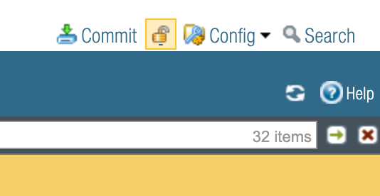
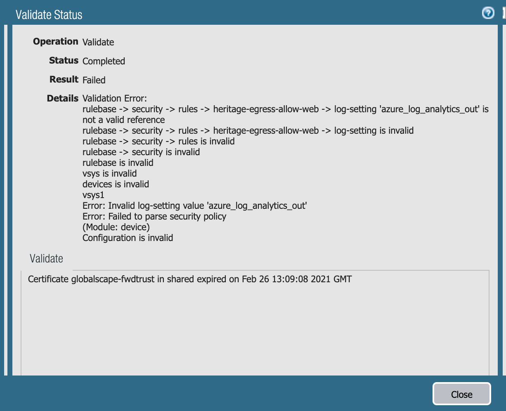

# Troubleshooting 


## Common errors  
---
### **Problem:** not able to connect to ansible host

#### **Example error:**
```bash
##[error]Terraform command 'apply' failed with exit code '1'.:  timeout - last error: dial tcp 51.137.145.88:22: i/o timeout
```

#### **Troubleshooting tip:**
This is most likely down to retrying steps in the pipeline. Each run a firewall rule is added to allow the devops agent to connect to the ansible agent and at the end of the pipeline it is removed so when you re-run failed steps in the pipeline you are not adding that rule back in, therefore the agent is unable to connect and you get the above error.

---
## Problem: Ansible has failed to apply the palo configuration

This error is usually caused by the Palo's XML config not applying due to malformed xml or incorrect references to objects etc. 

#### **Example error:**
```
module.hub-infra.module.firewall.null_resource.ansible-runs (remote-exec): fatal: [51.11.xxx.xxx]: FAILED! => {
...
...
...
module.hub-infra.module.firewall.null_resource.ansible-runs (remote-exec):     "msg": "Failed commit: Commit failed"
module.hub-infra.module.firewall.null_resource.ansible-runs (remote-exec): }
```

#### **Troubleshooting tip:**

1. Follow the steps in [the connecting guide](connecting.md) and log into one of the palos in the environment where your changes are failing to apply. 

2. Once you're logged in you will see a commit button in the top right-hand side of your screen like below:
    <details> 
    <summary>Commit Button</summary>

    
   
    </details>

3. A dialog box will pop up giving you the option to validate the most recent configuration, click on validate commit. 

    <details> 
    <summary>Validate Button</summary>

    

    </details>

4. This will run for a few seconds, once it's complete you'll be presented with a status page giving you a clearer idea of what the problem is. In this case we can see that the configuration is in fact invalid. The errors tell us that the `log-setting` value `azure_log_analytics_out` is incorrect, after looking through the code the `azure_log_analytics_out` log setting is a nonprod setting that isn't available in Production and just removing the line fixed the issue. 

    <details> 
    <summary>Validate Example</summary>
    
    
    
    </details>

5. Make your changes in the rdo-terraform-hub-dmz repoistory and run the [pipeline](https://dev.azure.com/hmcts/PlatformOperations/_build?definitionId=226&_a=summary) again.