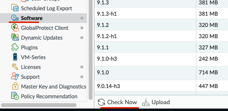

# Palo Alto Software Upgrade

It is recommended that the software version of the firewall be updated
frequently to take advantage of new next generation firewall features
to better help in securing the firewalls.

The steps to take are outlined in the [PAN-OS Software Updates](https://docs.paloaltonetworks.com/pan-os/9-0/pan-os-admin/software-and-content-updates/pan-os-software-updates.html) documentation
and are summarised and illustrated below as per the steps that have been recently taken
while upgrading from the `v9.1.x` version to the `v10.0.x`

## Prerequisite

* Make sure no running pipeline
* Perform dynamic updates, make sure latest versions are installed, go to `Device -> Dynamic Updates`
    - Update Applications and Threats
    - Update WildFire
* Make sure there are no candidate configuration that's not been committed, config has to be in a stable state
* Make a config backup, go to  `Device -> Setup -> Operations`
    - Save a named config snapshot
    - Export saved snapshot as backup to local location
  

   
Operations Tab

  
  

  

* Generate and export tech support file go to `Device -> Suport -> Tech Support File` 
  in case of issues that can't be resolved then you'd need to send this to Palo Alto support
* Check for latest available software go to `Device -> Software`. Click the Check Now at the button to refresh screen with latest software
  

   
Software view

  

  

    - Download the version(s) to be installed
* Same process as above but for Plugins, go to `Device -> Plugin` click `Check Now` for available plugins

**Notes** 
 - Always install latest available maintenance release before major release
e.g `v9.1.0-h3 -> 9.1.11-h3 before v10.0.0`
 - When moving to the `v10.1.x` release then that would be `v10.0.(max) -> v10.1.0 -> v10.1.x`
 - Don't forget there are two regions that's 4 firewall vm's to upgrade. In Panorama this might not be an 
   issue but if doing manually then you'd have to install separately on all four

## Steps
* ⚠️ Always start with `sbox`, if no issue when complete then chances of issues with `nonprod` and `prod` are very low
* Download if not already and install last available maintenance i.e `v9.1.11-h3` or `v10.0.(max)`
* Verify system is up and running, check cpu, memory, check firewall's system resources, should be reasonably low a 90% reading is a red flag wait until its dropped or investigate why it's so high
* Download and install next major release i.e. `v10.0.0` if coming from `v9.1.x` or `v10.1.0` if coming from `v10.0.x`
* Download if not already and install plugins if prompted
* Verify system is up and running, check cpu, memory, check firewall's system resources, if high wait until it settles, should not take long
* Download if not already and install next major release i.e. `v10.0.7` or `v10.1.x`
* Verify system is up and running, check cpu, memory etc

## Post Upgrade
* Rerun pipeline to see if any issues with current config with new version of software
* Fix forward if any issues, config might need to be updated
* Deleting old installation files to save space and cleanup is a nice to have
* Move to `nonprod` after `sbox` is stable and pipeline runs well i.e. commits current config
* Let team members know that the upgrade was successful
* 📕 Revisit in a quarter or 6 months time for another upgrade to keep the firewall software up-to-date
