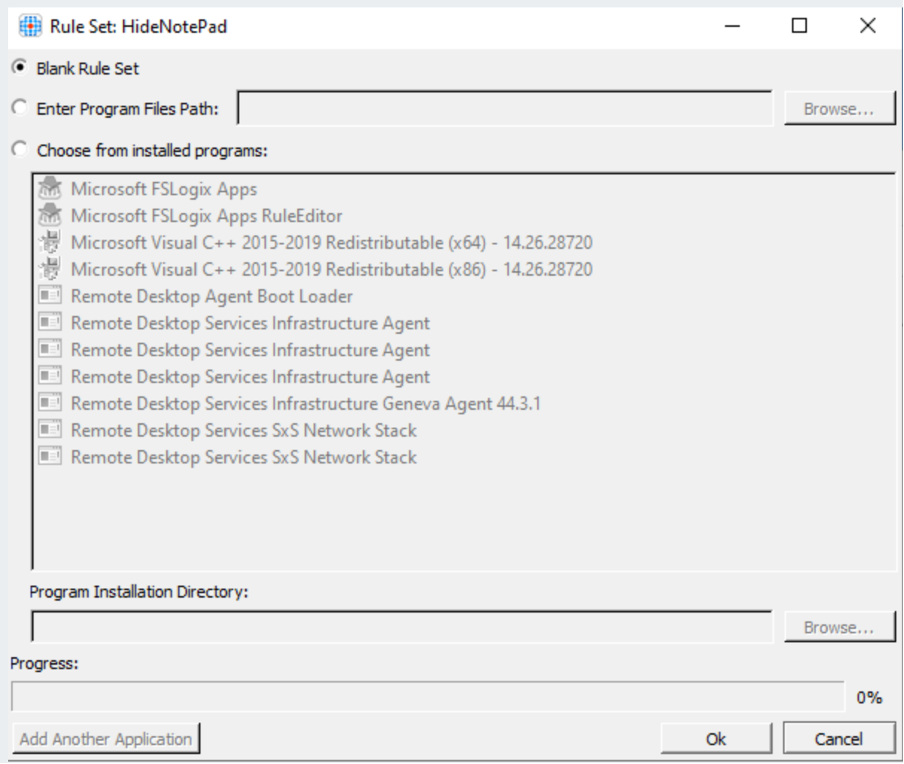
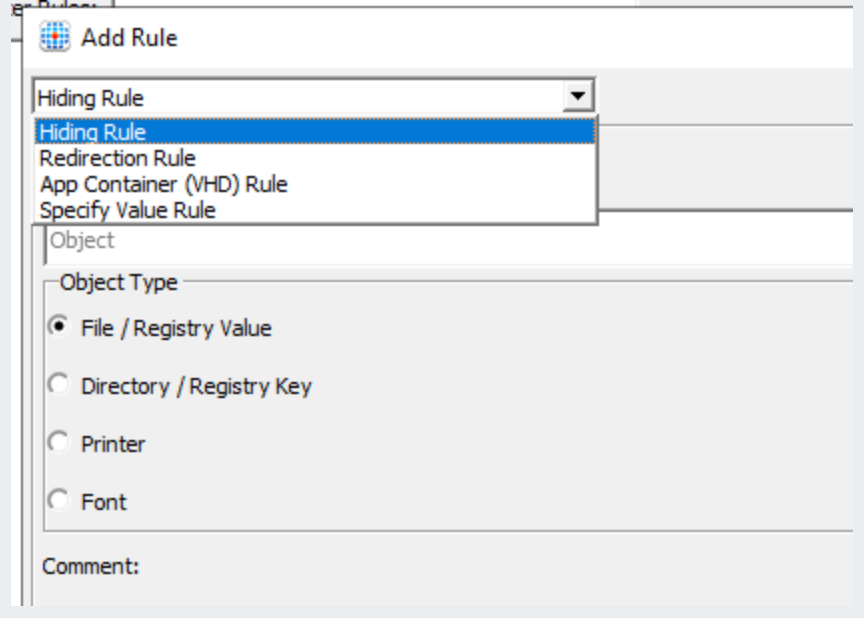
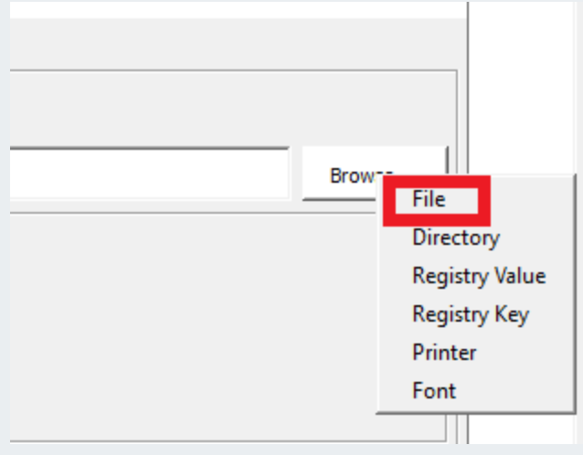
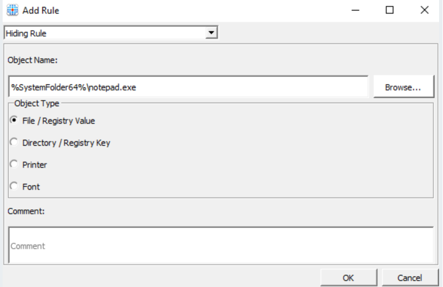
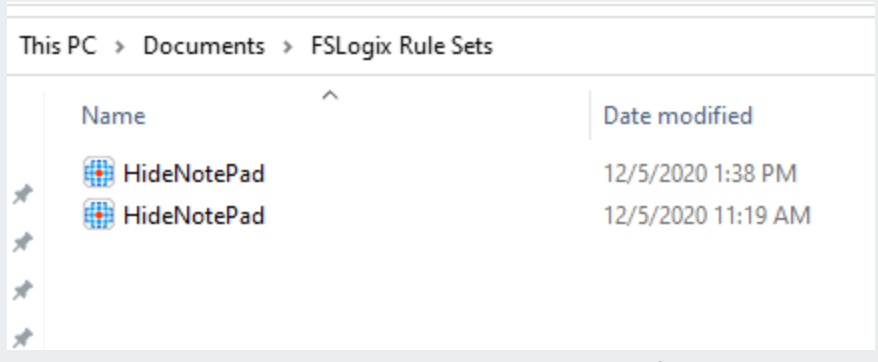

# FSLogix Application Masking

FSLogix App Rule Editor can be used to create rules to hide certain applications from users. In this example, we will create a rule to hide the Notepad application from users.

To create a rule to hide Notepad using FSLogix App Rule Editor, follow these steps:
Installing FSLogix Rule Editor
From the FSLogix page, there’s a URL called https://aka.ms/fslogix_download. When you click the download, it goes straight to the download folder. Open the folder and extract the FSLogix app. Then open x64 releases folder. In that, you will notice three options i.e
1 FSLogixAppsJavaRuleEditorSetup
2 FSLogixAppRuleEditorSetup
3 FSlogixAppsSetup
In our case, we select FSLogixAppRuleEditorSetup

Launch the rule editor application (right click and runs as administrator)

Click File and New, or click the new icon available towards the top of the application

For the purpose of this demo, Will hide Notepad so will name my rule HideNotepad as shown below. Click Enter file name when done

Creating a Blank Rule Set and clicking OK. If you’re app is already installed and visible, click Choose from installed programs.

Next,click on the + Icon to create a new rule.

There are several options to choose from.
Hiding Rule – Hides the specified items using specified criteria,
Redirection Rule – causes the specified item to be redirected as defined,
App container Rule – redirects the specified content into a VHD,
Specify value Rule – assigns a value for the specified item.

For this demo, Will be using the Hiding Rule. Select file

Browse to the application.exe located in the system32 folder. C:\Windows\System32 and click notepad

Click Ok and click Yes

Click the manage assignments icon as shown below. 

For this demo, will be hiding notepad for certain group(e.g-Orange Team) in the Rule Set. By default the rule applies to no one.Note that if you click on Everyone, the option is set to Rule Set does not apply to user/group.

Apply the rule for everyone apart from certain group (eg- Orange team). Click Save.
Browse to the location where the FSlogix rule sets are saved and copy the rules. See below

Copy files from: Documents\FSlogix rule sets to C:\Program Files\FSLogix\Apps\Rules

You’ll find that a number of files are automatically created by the FSLogix application in the CompiledRules location after copying the files.Files are copied to the Rules Folder and the automatically created files are compiled in the Compiled Rules folder.

In a production environment, you will want to create a network share including a copy of the rule sets from where you can automated the copy of files to your session hosts and update as and when requires from one central location.

## Testing:

Login with a user who is the part of the group(eg- Orange Team). Notepad will not be available for this group.By using this tool, you can create rules to hide or show applications and files to specific users or groups.

