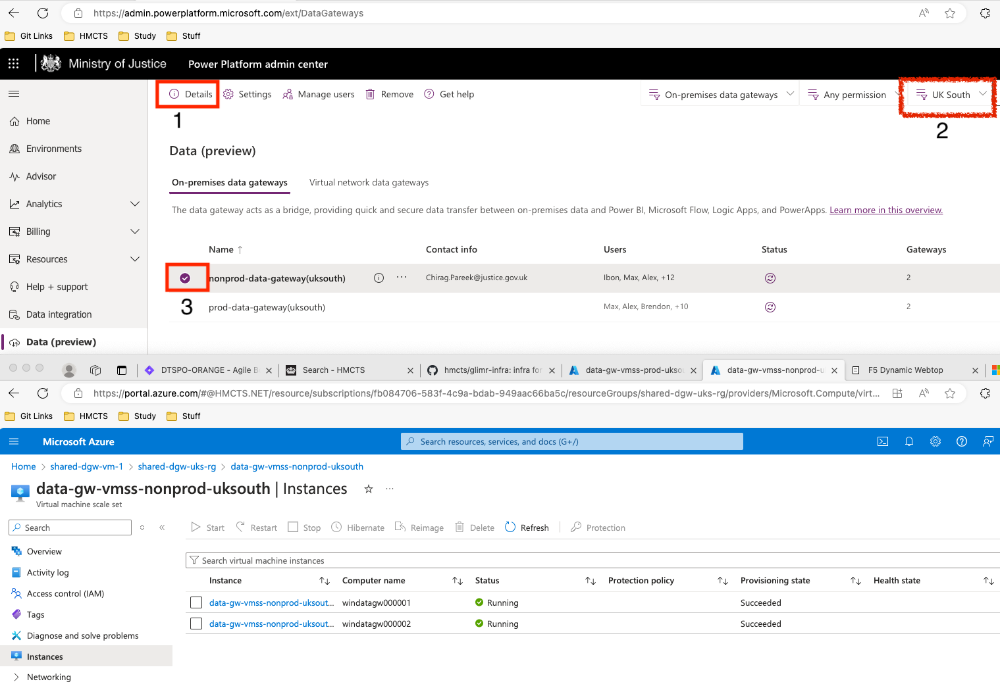

# <%= current_page.data.title %>

## Prerequisites

* Admin account to access the [Power Platform Portal](https://admin.powerplatform.microsoft.com/ext/DataGateways)

## Overview

On-premises gateways are Windows 2022 VMs running the Power Platform on-premises gate way service. They have been deployed as 2 node gateway clusters, in an actice/active configuration. The VMs are Azure virtual machine scale set instances.

The Power Platform portal has been deployed into HMCTS using both the North Europe (Default) and UK South.  Confusingly, the VMs hosting the on-premises gateways are both hosted in the UK South region, within the Azure portal. The Power Platform region, is selected using switch 2 in the diagram bellow. 

## Update an on-premises data gateway

Currently, Microsoft actively supports only the last six releases of the on-premises data gateway. With a new release update for data gateways, posted every month.

[Microsoft Learn Gateway Updates](https://learn.microsoft.com/en-us/data-integration/gateway/service-gateway-update)

We recommend that you update gateway members one after the other in a timely manner. This process reduces sporadic failures as a query may succeed on one gateway member, but not on the other, based on disparity in capabilities across different versions.

Use the following steps when updating a gateway cluster with two or more members:

1. Disable one gateway member.
2. Wait for ongoing work to be completed. A waiting period of 30 minutes is sufficient for most workloads, however clusters frequently running critical long running jobs may require more time for requests to drain.
3. Update the gateway member.
4. Enable the updated gateway member.
5. Repeat step 1-4 until all gateway members are updated.
Disabling a gateway makes sure the load balancer doesn't try to execute queries on the member you're updating, hence reducing delays and failures.

### HMCTS Update Tips

Cluster details can be view by selecting the cluster (3 in image above) then clicking details (1 in image above).

The Power Platform cluster device name, corresponds with the VMSS instance name, shown in the lower half of the above image.

To upgrade the service, RDP to the VM, using the username VMAdmin and password from the vault.

When viewing the cluster status details page in the Power Platform portal, it offers a link to the latest version of the software. This URL can be copied, pasted into each VM, to down load and perform an in place update of the on-premises gateway.

To see the 'new' version of the on-premises gateway in the portal, the node must 1st be enabled.  Allow 30-60 seconds for comminations to complete. Some browsers my cache the version number, so browse to the Power Platform portal home page, refresh (f5) and then browse back to the on-premises gateway page.  The correct information should now be displayed.  This may require 5 minutes to complete.

There is no requirement to add an email address into the installed client.  Sign-in is only required, if additional information about the client is required and to access the logging options.

