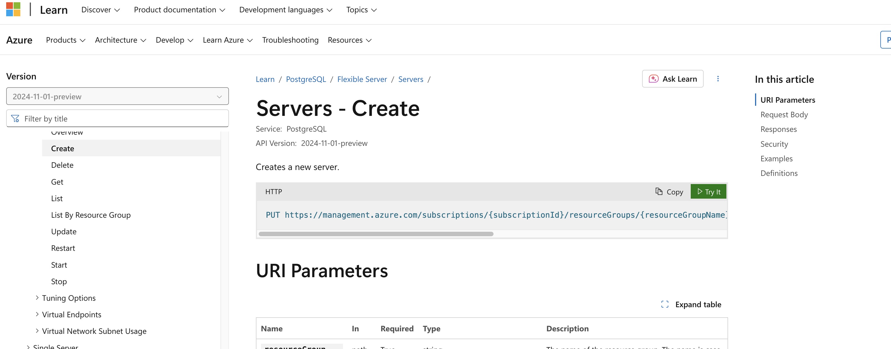
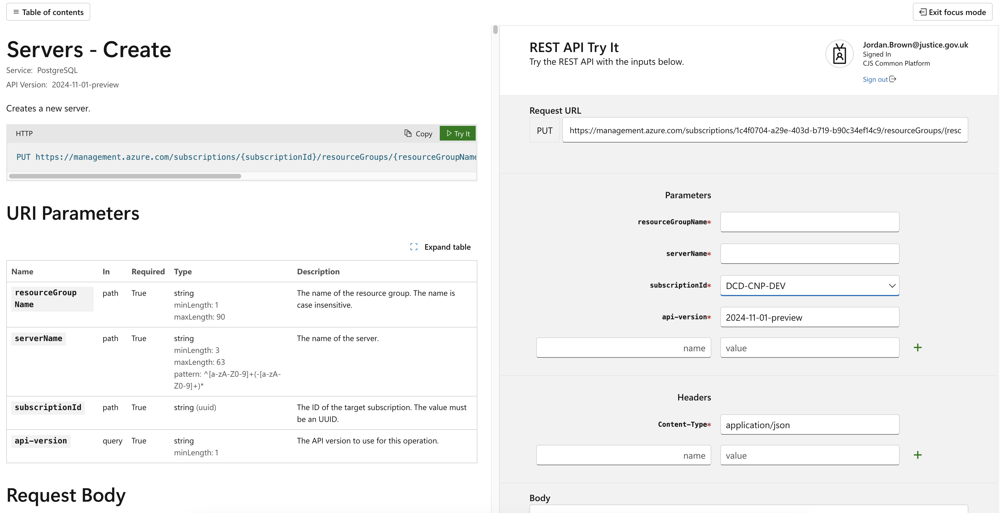

# <%= current_page.data.title %>

You can find detailed instructions on restoring a dropped Postgres flexible server instance [here](https://learn.microsoft.com/en-us/azure/postgresql/flexible-server/how-to-restore-dropped-server).

## Grabbing the JSON

1. Open the resource group that contained the dropped server. In the activity log, you should see the activity of the dropps server. This will contain info you'll need like sourceServerResourceId and DelegatedSubnetResourceId.
2. Open the microsoft page on [restoring a dropped server](https://learn.microsoft.com/en-us/azure/postgresql/flexible-server/how-to-restore-dropped-server).
3. Click the green 'try it' button under 'creates a new server'



4. Sign into your account and select the tenant
5. Enter the resourceGroupName, serverName, and select the subscriptionId. All this info will be in the json you grabbed earlier.



6. Under  body, you will need to include a payload similar to:

    ```
    {
    "location": "uksouth",
    "properties":
    {
      "pointInTimeUTC": "20xx-xx-xxTxx:xx:xxZ",
      "createMode": "ReviveDropped",
      "sourceServerResourceId": "/subscriptions/ffffffff-ffff-ffff-ffff-ffffffffffff/resourceGroups/SourceResourceGroup-Name/providers/Microsoft.DBforPostgreSQL/flexibleServers/SourceServer-Name",
    "Network": {
      "DelegatedSubnetResourceId": "/subscriptions/ffffffff-ffff-ffff-ffff-ffffffffffff/resourceGroups/SourceResourceGroup-Name/providers/Microsoft.Network/virtualNetworks/VirtualNetwork-Name/subnets/Subnet-Name",
      "PrivateDnsZoneArmResourceId": "/subscriptions/ffffffff-ffff-ffff-ffff-ffffffffffff/resourceGroups/SourceResourceGroup-Name/providers/Microsoft.Network/privateDnsZones/privatednszonename"
        }
    }
  }
    ```
**Note:** You may need to select 10 minutes BEFORE the deletion as pointInTimeUTC

7. After hitting 'run' you should see a '201' response. It's worth noting the servers can take several minutes to appear in the resource group, in some cases even after the activity log shows a failed job.