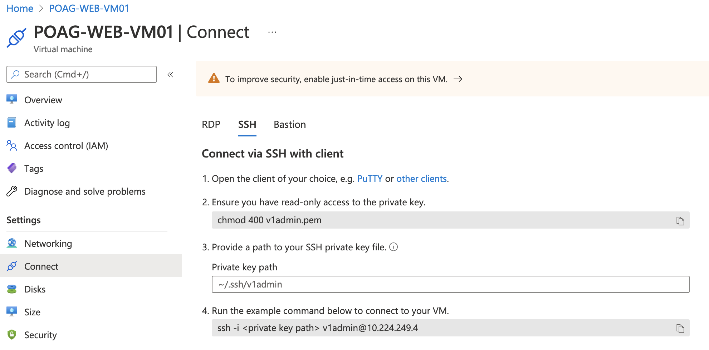

# Accessing Heritage EXTSVC Virtual Machines

Many External Services VMs in Heritage (also known as the spoke VMs) are currently not networked into the HMCTS bastions in the way that the rest of reform is. This document details how to gain access to these VMs, using `POAG-WEB-VM01` as an example.

1. Find the appropriate DevOps VM

Rather than being networked into the Bastions directly, most spoke VMs are only accessible from their management and devops VMs, which in turn are accessible from the HMCTS bastion. Either of these VMs will allow access to the spoke VM, but PlatOps should prefer access through the devops VM. Exactly what devops VM corresponds to the VM we're trying to get into may require some investigation if not readily known.

Using our example of `POAG-WEB-VM01`, in the azure portal, we can see that it's connected to the `vnet-prod-ext-01` virtual network.

If we have a look at the virtual network and search for a device that sounds vaguely devops-related, we can see a network interface attached to `PEXT-DEVOPS-VM01`. We can use this machine to access the spoke VM.


2. Find and Obtain the Admin Private Key

Both the EXTSVC VMs and the DevOps VMs rely on private key authentication for incomming connections.  We'll need to find out what private keys the machines want. Thankfully this is fairly easy.

If we have a look at the 'Connect' tab of `POAG-WEB-VM-01` in the Azure Portal, under 'SSH', we can see we'll need a private key called 'v1admin.pem'. `PEXT-DEVOPS-VM01` shows the same key.



These keys are almost always stored in a key vault within the same subscription as the VMs. In this case, both VMs are in the `DTS-HERITAGE-EXTSVC-PROD` subscription, which only has one key vault: `hmcts-kv-prod-ext`.

Private keys are located under the 'Secrets' tab of the key vault in the Azure Portal. If you don't have secret 'get' or 'list' permissions on the key vault in question, you may need to add an access policy for yourself under the 'Access policies' tab.

3. Gain bastion access for the desited environment.

Details on how to obtain bastion access can be found in [the Bastion documentation on Confluence](https://tools.hmcts.net/confluence/pages/viewpage.action?pageId=1411089455). Since `POAG-WEB-VM01` is a production VM, we'll need to request and obtain bastion access for the production environment.


4. SSH into the Bastion Server

```
ssh bastion-prod.platform.hmcts.net
```

5. SSH into the DevOps VM

You'll need to provide the private key to obtained in step 2 here. To do this, create a file and paste the value in. Name it something obvious so you don't forget what the key corresponds to. In this example, we'll use 'v1admin.pem'.

```
# Substitute an editor of your choice
vim v1admin.pem
```

If permissions on the private key are too permissive, SSH will refuse to accept it. Here we change the permissions to 400, which will prohibit reading by everyone except your user.

```
chmod 400 v1admin.pem
```

You can then provide the key to SSH using the `-i` flag:

```
# Connect to PEXT-DEVOPS-VM01
# Swap the IP out if connecting to a different VM
ssh -i v1admin.pem v1admin@10.224.249.196
```

6. SSH into the spoke VM

Finally we can SSH into the spoke VM. The admin private key may be present in the home directory of the machine you just SSH-ed into, albeit under a different name. If it is, you can just plug it right into SSH and log in to the spoke VM:

```
# Connect to POAG-WEB-VM01
# Swap the IP out if connecting to a different VM
ssh -i v1adminkey v1admin@10.224.249.4
```

You should now be connected to the spoke VM. While making the three SSH jumps, it can be easy to lose track of what machine you're connected to, especially if doing work across multiple spokes. If you're ever unsure, you can always check the hostname file to verify what machine you're on:

```
cat /etc/hostname
```
