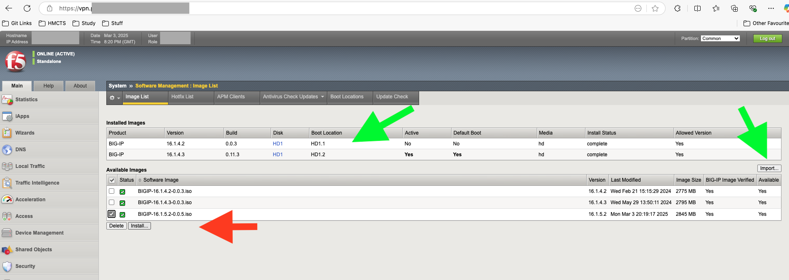
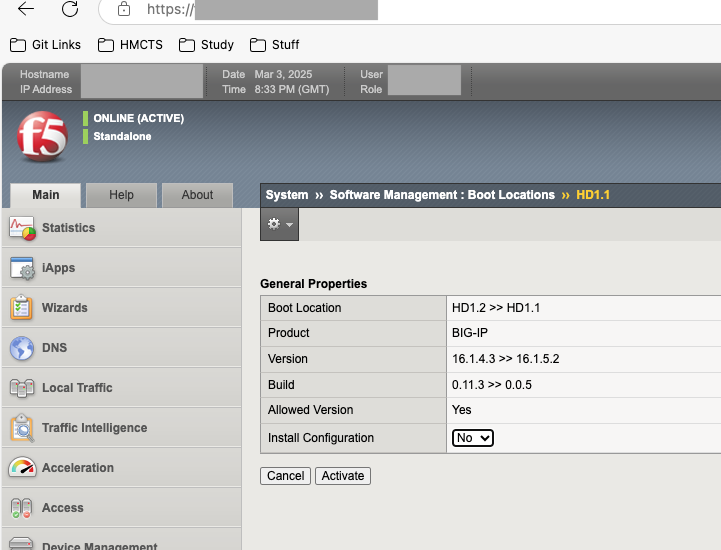

# <%= current_page.data.title %>

## IP Geolocation Database

Used to control access to the VPN based on the physical location of the user connection. The database is updated monthly and doesn't interrupt service.

[F5 Updating Guide PDF](https://www.f5.com/pdf/deployment-guides/bigip-update-upgrade-guide.pdf)
[Overview of system upgrades](https://my.f5.com/manage/s/article/K84554955)

## Prerequisites

1. GUI access to the F5 device with admin permissions. (Beware the Azure NSG rules)
2. Access to [my.f5.com](https://my.f5.com) and "HM Courts & Tribunals Service" account to download the latest updates.

## Process

1. Power on the test F5. Azure VM mgmt-vpn
2. Confirm current versions of BIG-IP OS, apmclients and EPsec
3. Download the latest updates from MyF5
4. Backup the F5 configuration to laptop and snapshot the VM
5. Upload the updates to the F5 device
6. Install the updates
7. Reboot the F5 device
8. Confirm the updates have been applied
9. Test the VPN connection
10. Accept the F5 client software updates on test laptop
11. Confirm the VPN connection is working
12. Download the HMCTS specific F5 client software from the F5 device
13. Power off the test F5
14. Forward the F5 client software to the HMCTS Package team for deployment
15. Create change request for the production system update, requires 2 reboots and will interrupt service
16. Backup production system
17. Update the production system
18. Confirm the updates have been applied
19. Test the VPN connection

## Update F5 BIG-IP System

1. Log into the F5 Web Admin portal with admin permissions using a web browser
2. Select System / Software Management / Image List from the menu

3. Click the Import button
4. Browse to the location of the downloaded update file and click Open
5. Click Import - Wait about 10 minutes
6. Select the new software image and click Install
7. Install Software image wizard - Select the disk and version to install. Click Install - Wait about 10 minutes
8. Browse to System / Software Management / Boot Locations. Select new OS boot location

9. Click activate and the F5 will reboot into the new image
10. After reboot, log in and browse to System / Configuration / Device / General to confirm OS version
11. Browse to System / Software Management / APM Clients / New Image
12. Select choose file and select new APM image - Wait 2 minutes
13. Select Import
14. Select the image and click install
15. Select the new image in the list and select install
16. Select Antivirus Check Updates from menu and repeat steps 12 - 15 with epsec.iso image.
17. Test VPN access
